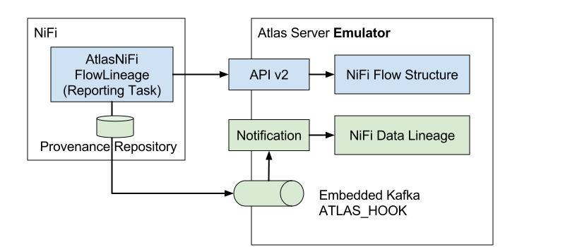
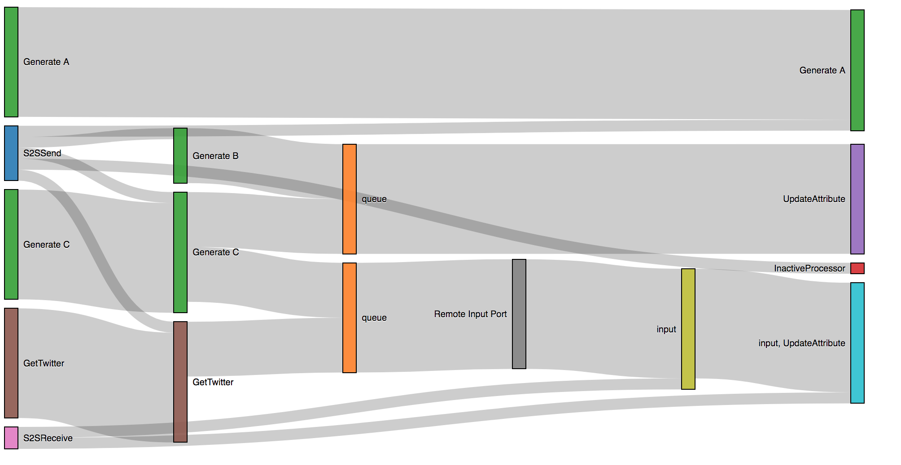

<!--
  Licensed to the Apache Software Foundation (ASF) under one or more
  contributor license agreements.  See the NOTICE file distributed with
  this work for additional information regarding copyright ownership.
  The ASF licenses this file to You under the Apache License, Version 2.0
  (the "License"); you may not use this file except in compliance with
  the License.  You may obtain a copy of the License at
      http://www.apache.org/licenses/LICENSE-2.0
  Unless required by applicable law or agreed to in writing, software
  distributed under the License is distributed on an "AS IS" BASIS,
  WITHOUT WARRANTIES OR CONDITIONS OF ANY KIND, either express or implied.
  See the License for the specific language governing permissions and
  limitations under the License.
-->
# Apache Atlas Server Emulator

Since [Apache Atlas](http://atlas.apache.org/) uses multiple data storage such as Apache HBase, Apache Kafka and Apache Solr, it can be time consuming to setup a test environment, or resetting those storage to store other test data.

In order to execute Atlas client side testing and debugging more aggressively, this Atlas Server Emulator is created.

It can be run as a Java process from your IDE, and let Apache NiFI ReportLineageToAtlas reporting task to call Atlas V2 REST APIs and send notification messages. The emulator runs a Jetty REST API server emulator and an embedded Kafka broker.

The emulator keeps created Atlas entities on RAM. So you can reset its state by simply restarting the emulator process.

## How to start

Run org.apache.nifi.atlas.emulator.AtlasAPIV2ServerEmulator.

## How to debug reported entities

Configure ReportLineageToAtlas reporting task as follows:

- Atlas URLs: http://localhost:21000
- Create Atlas Configuration File: true
- Kafka Bootstrap Servers: localhost:9092
- Fill required properties and leave other configurations default

Once the reporting task runs, you can visit http://localhost:21000/graph.html to see a lineage graph looks like this:

## ITReportLineageToAtlas

ITReportLineageToAtlas is a automated test class using multiple NiFi flow templates and Atlas Server Emulator to test the entire NiFiAtlasFlowLineage reporting task behavior including registered NiFiProvenanceEventAnalyzer implementations.

This test class is not executed as a normal unit test class because it is takes longer. However, it's recommended to run this class when the reporting task code is modified to confirm existing situations are still handled as expected.

You can see NiFi flows used at the test class by importing NiFi flow template files in test/resources/flow-templates to your NiFi instance.

Similarly, you can create new test methods by creating a NiFi flow template and load it from the method. NiFi provenance events can be generated programmatically. After ReportLineageToAtlas reporting task runs, test methods can verify the created Atlas entities and lineages.