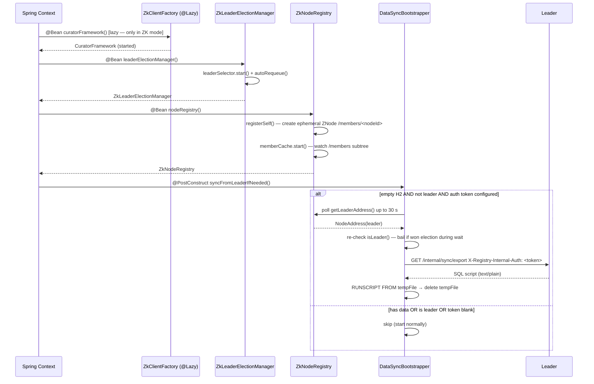
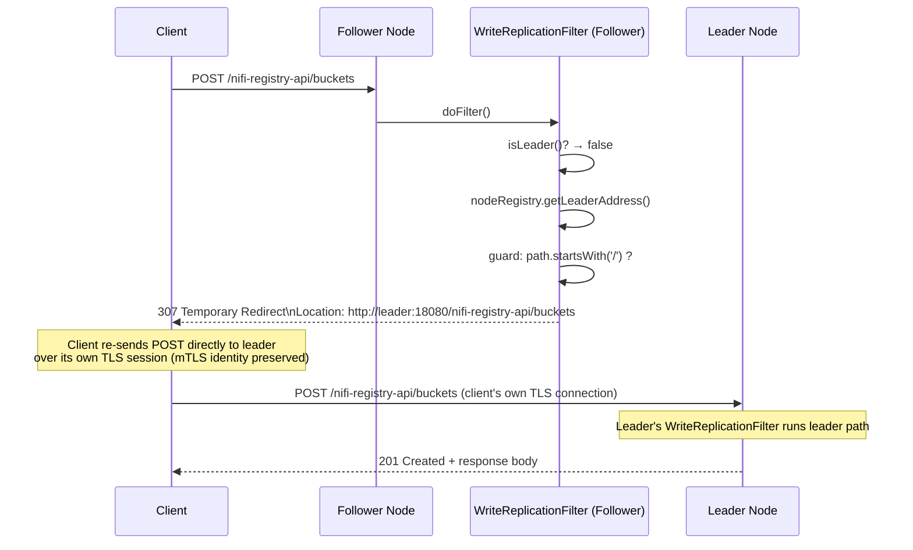
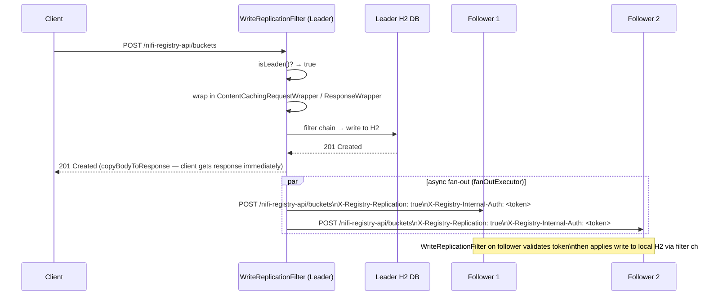
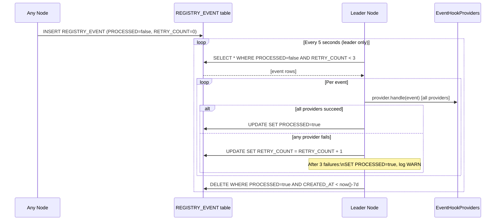

# NIFI-8843 — NiFi Registry High Availability

**JIRA:** NIFI-8843
**Commit:** NIFI-8843: ZooKeeper leader election for NiFi Registry HA
**Status:** Implemented and deployed

---

## Table of Contents

1. [Background and Goals](#1-background-and-goals)
2. [High-Level Design](#2-high-level-design)
   - [Architecture Overview](#21-architecture-overview)
   - [Coordination Modes](#22-coordination-modes)
   - [Key Design Decisions](#23-key-design-decisions)
3. [Low-Level Design](#3-low-level-design)
   - [Maintenance Mode](#31-maintenance-mode)
   - [Leader Election](#32-leader-election)
   - [Cluster Membership](#33-cluster-membership)
   - [Write Replication](#34-write-replication)
   - [Cache Coherency](#35-cache-coherency)
   - [Event Delivery](#36-event-delivery)
   - [Bootstrap DB Sync](#37-bootstrap-db-sync)
   - [ZooKeeper TLS](#38-zookeeper-tls)
   - [Cluster Health Indicator](#39-cluster-health-indicator)
4. [Database Schema](#4-database-schema)
5. [Security Model](#5-security-model)
6. [Configuration Reference](#6-configuration-reference)
7. [Flow Diagrams](#7-flow-diagrams)
   - [Startup Sequence](#71-startup-sequence)
   - [Write Request — Follower Path](#72-write-request--follower-path)
   - [Write Request — Leader Path](#73-write-request--leader-path)
   - [Event Delivery Flow](#74-event-delivery-flow)
   - [Bootstrap DB Sync Flow](#75-bootstrap-db-sync-flow)
8. [Component Map](#8-component-map)
9. [Deployment Guide](#9-deployment-guide)

---

## 1. Background and Goals

NiFi Registry persists flow snapshots, extension bundles, and access policies in a relational database. Prior to this change **NiFi Registry had no High Availability support at all** — only a single node could be deployed. Running multiple Registry nodes was not a supported configuration:

- There was no leader election mechanism.
- There was no write coordination — concurrent writes to separate nodes would diverge silently.
- Authorization caches were local and had no cross-node invalidation.
- `EventHookProvider` callbacks would fire independently on every node for the same event.
- There was no way to bootstrap a new node from the existing cluster state.

**NIFI-8843 introduces HA to NiFi Registry for the first time. Its goals are:**

| Goal | Mechanism |
|---|---|
| Run ≥ 2 Registry nodes each with their own local H2 | Write replication via `WriteReplicationFilter` |
| Elect exactly one leader for write coordination | ZooKeeper Curator `LeaderSelector` or DB TTL lease |
| Keep authorization caches coherent across all nodes | ZK ZNode watchers (ZK mode) or CACHE_VERSION table polling (DB mode) |
| Deliver `EventHookProvider` callbacks exactly once per cluster | `ClusterAwareEventService` with DB-backed event log |
| Bootstrap a new/empty node from the cluster | `DataSyncBootstrapper` pull-on-startup via H2 `SCRIPT` export |
| Reject writes during planned maintenance | `MaintenanceModeFilter` + Spring Boot Actuator endpoint |
| Observe cluster health from a load balancer | `ClusterHealthIndicator` at `/actuator/health` |

---

## 2. High-Level Design

### 2.1 Architecture Overview

```
                        ┌──────────────────────────────────────────┐
                        │            Apache ZooKeeper               │
                        │  /nifi-registry/leaders/registry-leader   │
                        │  /nifi-registry/members/<nodeId>          │
                        │  /nifi-registry/cache-version/...         │
                        └──────────────────┬───────────────────────┘
                                           │  Curator / ZK client
              ┌────────────────────────────┼───────────────────────────┐
              │                            │                           │
 ┌────────────▼──────────┐   ┌─────────────▼──────────┐   ┌────────────▼──────────┐
 │    NiFi Registry      │   │    NiFi Registry       │   │    NiFi Registry      │
 │      Node 0           │   │      Node 1            │   │      Node 2           │
 │    (LEADER)           │   │    (FOLLOWER)          │   │    (FOLLOWER)         │
 │                       │   │                        │   │                       │
 │  ┌─────────────────┐  │   │   ┌─────────────────┐  │   │  ┌─────────────────┐  │
 │  │  H2 Database    │  │   │   │  H2 Database    │  │   │  │  H2 Database    │  │
 │  │  (authoritative │  │   │   │  (replica)      │  │   │  │  (replica)      │  │
 │  │   for writes)   │  │   │   └─────────────────┘  │   │  └─────────────────┘  │
 │  └─────────────────┘  │   │                        │   │                       │
 │ WriteReplicationFilter│   │ WriteReplicationFilter │   │ WriteReplicationFilter│
 │ (fan-out to followers)│   │  (307 → leader)        │   │  (307 → leader)       │
 └───────────────────────┘   └────────────────────────┘   └───────────────────────┘
              │                            ▲                            ▲
              └────── X-Registry-Replication fan-out ───────────────────┘
```

**Traffic flow:**
- **Reads** — served by any node from its local DB.
- **Writes from a client to a follower** — follower returns `307 Temporary Redirect` to the leader; client re-sends directly.
- **Writes to the leader** — committed to leader's local H2, then fanned out asynchronously to all followers via `X-Registry-Replication` requests.
- **Coordination** — ZooKeeper provides leader election, membership tracking, and push-based cache invalidation.

### 2.2 Coordination Modes

Two backends are selectable via `nifi.registry.cluster.coordination`:

| Value | Leader election | Cache invalidation | DB requirement |
|---|---|---|---|
| `database` (default) | TTL lease in `CLUSTER_LEADER` table | Poll `CACHE_VERSION` every 15 s | Shared PostgreSQL / MySQL |
| `zookeeper` | Curator `LeaderSelector` | ZNode `setData()` push via `CuratorCache` | Per-node local H2 (or shared RDBMS) |

> **ZooKeeper mode enables per-node local H2.** Database mode requires a shared RDBMS because all nodes read and write the same DB.

### 2.3 Key Design Decisions

**Why 307 redirect instead of transparent follower→leader proxy?**
Transparent proxying via `JDK HttpClient` cannot carry the original client's X.509 certificate on the outbound connection — the follower's own certificate is substituted. In mTLS deployments the leader would receive the request under the wrong identity. A `307 Temporary Redirect` lets the client re-send its write directly to the leader over its own TLS session, preserving X.509 identity end-to-end. `307` (not `302`) is required so that the HTTP method (`POST` / `PUT` / `PATCH` / `DELETE`) is preserved.

**Why Curator `LeaderSelector` over a DB TTL lock?**
Curator participates in a distributed mutex backed by ZooKeeper's strongly-consistent ephemeral nodes. Leader loss is detected within one ZK session timeout (~10 s) rather than one lease interval (~30 s). It integrates directly with connection-state events so the leader yields immediately on `SUSPENDED`/`LOST`, preventing split-brain.

**Why asynchronous leader-to-follower fan-out?**
The client's latency is bounded by the leader's local write only. Follower replication is fire-and-forget; transient follower failures do not fail the client's request. Followers that miss a fan-out will receive the write on the next bootstrap sync or when they rejoin.

**Why H2's `SCRIPT` / `RUNSCRIPT` for bootstrap?**
H2 natively produces a portable SQL dump (`SCRIPT DROP NOPASSWORDS NOSETTINGS`) that can be replayed with `RUNSCRIPT FROM`. No external tooling or additional dependencies required.

---

## 3. Low-Level Design

### 3.1 Maintenance Mode

A node can be placed into maintenance mode to reject incoming writes while administrative tasks (e.g., backups, rolling upgrades) are performed.

#### Components

- **`MaintenanceModeManager`** — Spring singleton holding the `volatile boolean maintenanceMode` flag. Exposes `enable()` / `disable()` / `isEnabled()`.
- **`MaintenanceModeFilter`** — `GenericFilterBean` registered in the security filter chain. On write requests (`POST`/`PUT`/`PATCH`/`DELETE`) while maintenance mode is active:
  - Returns `503 Service Unavailable` with `Retry-After: 60`.
  - Unauthenticated requests that would normally get a `401` still get `401` (the filter runs after `ResourceAuthorizationFilter`), not `503`.
- **`MaintenanceModeEndpoint`** — Spring Boot Actuator endpoint at `/actuator/maintenance`. `GET` returns current state; `POST {"enabled":true/false}` toggles it.
- **`MaintenanceModeHealthIndicator`** — contributes `maintenance: {status: "UP", details: {enabled: false}}` to `/actuator/health`.

### 3.2 Leader Election

#### Interface

```java
public interface LeaderElectionManager {
    boolean isLeader();
    void addLeaderChangeListener(LeaderChangeListener listener);
    default Optional<String> getLeaderNodeId() { return Optional.empty(); }
}

public interface LeaderChangeListener {
    void onStartLeading();
    void onStopLeading();
}
```

#### ZkLeaderElectionManager

Uses Apache Curator's `LeaderSelector` with `autoRequeue()`. The node continuously participates in the election.

- **ZNode path:** `<rootNode>/leaders/registry-leader` (default: `/nifi-registry/leaders/registry-leader`)
- **`takeLeadership()`** blocks in a 100 ms loop, re-verifying with ZooKeeper every 5 s (`VERIFY_CACHE_MS`). Returns when disabled or ZK reports another leader.
- **`isLeader()`** caches the ZK-verified result for `VERIFY_CACHE_MS` to avoid per-call ZK round-trips.
- **Connection-state changes:** On `SUSPENDED` or `LOST` the leader flag is cleared immediately and `onStopLeading()` is fired; leadership is never claimed without an active ZK session.
- **`getLeaderNodeId()`** delegates to `leaderSelector.getLeader().getId()`.
- **`@Lazy` `CuratorFramework` bean** — only instantiated when first requested; never created in standalone or DB-coordination mode even with a blank connect string.

#### DatabaseLeaderElectionManager

Single row in `CLUSTER_LEADER` table (`LOCK_KEY = 'LEADER'`). Three-step acquisition on a background scheduler (heartbeat every 10 s, lease 30 s):

1. Renew own lease: `UPDATE ... WHERE NODE_ID=? AND EXPIRES_AT > now()`
2. Steal expired lease: `UPDATE ... WHERE EXPIRES_AT <= now()`
3. First boot insert: `INSERT INTO CLUSTER_LEADER ...`

Does not fire `LeaderChangeListener` callbacks (used in ZK mode only).

### 3.3 Cluster Membership

#### ZkNodeRegistry

At startup, each node registers itself as an ephemeral ZNode:

```
/nifi-registry/members/<nodeId>   →  data: <baseUrl>   e.g. "http://node0:18080"
```

A `CuratorCache` on `<rootNode>/members` fires `NODE_CREATED` / `NODE_CHANGED` / `NODE_DELETED` events and keeps an in-memory `ConcurrentHashMap<nodeId, baseUrl>` current.

- **`getLeaderAddress()`** — resolves `leaderElectionManager.getLeaderNodeId()` to a `NodeAddress` via the members map.
- **`getOtherNodes()`** — filters out `selfNodeId`, used by the leader for fan-out.

#### NodeAddress

```java
public final class NodeAddress {
    private final String nodeId;   // e.g. "nifi2-0"
    private final String baseUrl;  // e.g. "http://nifi2-0:18080"
}
```

### 3.4 Write Replication

#### WriteReplicationFilter

`GenericFilterBean` registered **before** `ResourceAuthorizationFilter` in the Spring Security chain (allowing leader→follower fan-out requests to bypass per-resource authorization on the receiving follower).

Decision tree:

```
Is method read-only (GET / HEAD / OPTIONS)?        → pass through
Is path under /actuator/?                          → pass through
Is nodeRegistry or replicationClient null?         → pass through (standalone / DB mode)
Has X-Registry-Replication header?
  → validate X-Registry-Internal-Auth (403 if missing or wrong)
  → apply write to local DB via filter chain, return
Is NOT leader?
  → validate path starts with '/' (400 if not — open-redirect guard)
  → 307 Temporary Redirect; Location: <leaderBaseUrl><path>[?<queryString>]
IS leader
  → wrap in ContentCachingRequestWrapper / ContentCachingResponseWrapper
  → invoke filter chain (local write)
  → copyBodyToResponse() to flush to client
  → if 2xx: async fan-out to all followers via replicateToFollowers()
```

#### HttpReplicationClient

Backs `ReplicationClient`. Uses the JDK `HttpClient` (JDK 11+) — no additional Maven dependency.

- **`replicateToFollowers()`** — submits one task per follower to a `CachedThreadPool` executor. Each task adds:
  - `X-Registry-Replication: true`
  - `X-Registry-Internal-Auth: <token>`
  - Strips hop-by-hop headers (RFC 7230 §6.1): `Connection`, `Keep-Alive`, `Transfer-Encoding`, `TE`, `Trailers`, `Upgrade`, `Proxy-Authorization`, `Proxy-Authenticate`, `Content-Length`.
- Failures are logged (`WARN` on 4xx/5xx, `ERROR` on exception) but do not block the caller.
- `DisposableBean.destroy()` shuts down the fan-out executor with a 5 s grace period.

### 3.5 Cache Coherency

Authorization policy and user-group caches must be invalidated after every write so followers don't serve stale access decisions.

#### ZK Mode — ZkCacheInvalidator

- On write: `client.setData().forPath(<rootNode>/cache-version/<domain>, versionBytes)`
- `CuratorCache` watcher on that path fires on all peers immediately (~1–5 ms ZK propagation).
- Watcher calls `provider.onCacheChange()` → reload from local DB.

#### Database Mode — DatabaseCacheInvalidator + CacheRefreshPoller

- On write: `UPDATE CACHE_VERSION SET VERSION = VERSION + 1 WHERE CACHE_DOMAIN = ?`
- `CacheRefreshPoller` runs every `nifi.registry.cluster.cache.refresh.interval.ms` (default 15 s), compares the row value against the last-seen version, triggers reload on mismatch.
- In ZK mode, `CacheRefreshPoller.start()` is a no-op.

### 3.6 Event Delivery

`ClusterAwareEventService` provides **at-least-once** delivery of `EventHookProvider` callbacks across the cluster. `EventHookProvider` implementations **must be idempotent** — a retry after a partial failure re-delivers to providers that already succeeded.

**Publish path (any node):**
1. Serialize `Event` → JSON (`EventRecord` with typed field list).
2. `INSERT INTO REGISTRY_EVENT (EVENT_ID, EVENT_TYPE, EVENT_DATA, CREATED_AT, PROCESSED, RETRY_COUNT) VALUES (...)`

**Delivery loop (leader only, every 5 s):**
1. `SELECT * FROM REGISTRY_EVENT WHERE PROCESSED = FALSE AND RETRY_COUNT < 3 ORDER BY CREATED_AT`
2. For each row: deserialize, call each `EventHookProvider.handle(event)`.
3. Success → `UPDATE REGISTRY_EVENT SET PROCESSED = TRUE WHERE EVENT_ID = ?`
4. Failure → `UPDATE REGISTRY_EVENT SET RETRY_COUNT = RETRY_COUNT + 1 WHERE EVENT_ID = ?`. After 3 failures: mark `PROCESSED = TRUE`, log `WARN`.
5. Purge: `DELETE FROM REGISTRY_EVENT WHERE PROCESSED = TRUE AND CREATED_AT < now() - 7 days`

**Leader-change acceleration:** `ClusterAwareEventService` implements `LeaderChangeListener`. `onStartLeading()` submits an immediate `deliverPendingEvents()`, eliminating the up-to-5 s delay after a leader election.

**Standalone mode:** `StandardEventService` — in-memory synchronous delivery, no DB involvement.

### 3.7 Bootstrap DB Sync

Activated at `@PostConstruct` time. Guards (all must pass to proceed):

1. `nifi.registry.cluster.enabled = true` AND `coordination = zookeeper`
2. `NodeRegistry` bean is present
3. `leaderElectionManager.isLeader() == false`
4. Local DB is H2
5. `SELECT COUNT(*) FROM BUCKET` returns 0
6. `nifi.registry.cluster.node.internal.auth.token` is configured (non-blank) — if blank, logs `WARN` and returns; node starts with empty DB and populates via write replication

**Sync procedure:**
1. Poll `nodeRegistry.getLeaderAddress()` for up to 30 s (1 s intervals).
2. Re-check `isLeader()` — this node may have won election during the wait; if so, skip.
3. `GET <leaderBaseUrl>/nifi-registry-api/internal/sync/export` with `X-Registry-Internal-Auth` header.
4. Write response body to `Files.createTempFile("registry-bootstrap-", ".sql")`.
5. Execute `RUNSCRIPT FROM '<tempFile>'` via JDBC.
6. Delete temp file (finally block).

**`InternalSyncResource` (`GET /internal/sync/export`):**
- Returns `403 Forbidden` if auth token is missing or invalid (constant-time compare).
- Returns `503 Service Unavailable` if this node is not the leader.
- Executes `SCRIPT DROP NOPASSWORDS NOSETTINGS` over JDBC and streams the SQL as `text/plain`.

### 3.8 ZooKeeper TLS

When `nifi.registry.zookeeper.client.secure=true`, `ZkClientFactory.applyTlsSystemProperties()` sets JVM system properties before the `CuratorFramework` is built:

| System property | Configured from |
|---|---|
| `zookeeper.client.secure` | `true` |
| `zookeeper.clientCnxnSocket` | `org.apache.zookeeper.ClientCnxnSocketNetty` |
| `zookeeper.ssl.keyStore.location` | `nifi.registry.zookeeper.security.keystore` |
| `zookeeper.ssl.keyStore.type` | `nifi.registry.zookeeper.security.keystoreType` |
| `zookeeper.ssl.keyStore.password` | `nifi.registry.zookeeper.security.keystorePasswd` |
| `zookeeper.ssl.trustStore.location` | `nifi.registry.zookeeper.security.truststore` |
| `zookeeper.ssl.trustStore.type` | `nifi.registry.zookeeper.security.truststoreType` |
| `zookeeper.ssl.trustStore.password` | `nifi.registry.zookeeper.security.truststorePasswd` |

Requires ZooKeeper 3.5.5+ with TLS enabled server-side. The Netty socket factory is required for client-side TLS.

### 3.9 Cluster Health Indicator

`ClusterHealthIndicator` implements `HealthIndicator` and is included in the Spring Boot Actuator composite health response at `GET /actuator/health`.

**Standalone response:**
```json
{ "status": "UP", "details": { "mode": "standalone" } }
```

**ZK cluster response:**
```json
{
  "status": "UP",
  "details": {
    "mode": "zookeeper",
    "role": "leader",
    "leaderId": "nifi2-2.nifi2.example.svc.cluster.local",
    "selfId": "nifi2-2.nifi2.example.svc.cluster.local",
    "memberCount": 3,
    "members": ["nifi2-2...", "nifi2-1...", "nifi2-0..."]
  }
}
```

The overall status is always `UP` — a follower that lost its ZK connection can still serve reads.

**Management port security:** `ManagementServerConfiguration` uses Undertow and enforces loopback-only access (`127.0.0.1` / `::1`) at the security layer — requests from any other address receive `403 Forbidden` even if the management port is accidentally bound to a non-loopback interface.

---

## 4. Database Schema

All cluster tables are introduced in Flyway migration **V9** (`V9__AddClusterTables.sql`), applied to all three DB variants (H2/default, MySQL, PostgreSQL).

### CACHE_VERSION

```sql
CREATE TABLE CACHE_VERSION (
    CACHE_DOMAIN VARCHAR(50) NOT NULL,
    VERSION      BIGINT      NOT NULL DEFAULT 0,
    CONSTRAINT PK__CACHE_VERSION PRIMARY KEY (CACHE_DOMAIN)
);

INSERT INTO CACHE_VERSION (CACHE_DOMAIN, VERSION) VALUES ('ACCESS_POLICIES', 0);
INSERT INTO CACHE_VERSION (CACHE_DOMAIN, VERSION) VALUES ('USER_GROUPS', 0);
```

Used in `database` coordination mode. Polled by `CacheRefreshPoller`; incremented by `DatabaseCacheInvalidator`.

### CLUSTER_LEADER

```sql
CREATE TABLE CLUSTER_LEADER (
    LOCK_KEY   VARCHAR(50)  NOT NULL,
    NODE_ID    VARCHAR(100) NOT NULL,
    EXPIRES_AT TIMESTAMP    NOT NULL,
    CONSTRAINT PK__CLUSTER_LEADER PRIMARY KEY (LOCK_KEY)
);
```

Exactly one row (`LOCK_KEY = 'LEADER'`). Used by `DatabaseLeaderElectionManager` in `database` coordination mode.

### REGISTRY_EVENT

```sql
CREATE TABLE REGISTRY_EVENT (
    EVENT_ID    VARCHAR(50)  NOT NULL,
    EVENT_TYPE  VARCHAR(100) NOT NULL,
    EVENT_DATA  TEXT         NOT NULL,
    CREATED_AT  TIMESTAMP    NOT NULL,
    PROCESSED   BOOLEAN      NOT NULL DEFAULT FALSE,
    RETRY_COUNT INTEGER      NOT NULL DEFAULT 0,
    CONSTRAINT PK__REGISTRY_EVENT PRIMARY KEY (EVENT_ID)
);
```

Used in both coordination modes. Any node inserts; the leader delivers. Events with `RETRY_COUNT >= 3` are marked processed with a `WARN` log. Processed rows older than 7 days are purged.

---

## 5. Security Model

### Shared Internal Auth Token

All inter-node requests (leader fan-out and bootstrap sync export) carry:

```
X-Registry-Internal-Auth: <token>
```

The token is configured via `nifi.registry.cluster.node.internal.auth.token` and must be identical on every node. Recommended: ≥ 64 random hex characters.

Validation uses `MessageDigest.isEqual(expected.getBytes(UTF_8), received.getBytes(UTF_8))` — constant-time comparison preventing timing side-channel enumeration.

### Filter Chain Ordering

```
ResourceAuthorizationFilter
    ↑ before (WriteReplicationFilter validates its own token — no Spring Security needed)
WriteReplicationFilter
    ↑ after (MaintenanceModeFilter runs after; 503-rejected writes never reach replication)
MaintenanceModeFilter
```

The security config rule:

```java
.requestMatchers(req -> req.getHeader(WriteReplicationFilter.REPLICATION_HEADER) != null)
.permitAll()
```

Replicated requests bypass Spring Security auth — they are validated by `WriteReplicationFilter` via the constant-time token check before any local processing.

### Management Port Access Control

`ManagementServerConfiguration` rejects all non-loopback requests with `403 Forbidden`:

```java
.requestMatchers(req -> isLoopbackAddress(req.getRemoteAddr())).permitAll()
.anyRequest().denyAll()
```

### Transport Security Recommendations

1. Enable HTTPS on all nodes (`nifi.registry.web.https.*`).
2. Enable ZooKeeper TLS (`nifi.registry.zookeeper.client.secure=true`) with a dedicated ZK keystore/truststore.
3. Use a long random `nifi.registry.cluster.node.internal.auth.token` (≥ 64 hex chars).

---

## 6. Configuration Reference

```properties
# ── Cluster basics ─────────────────────────────────────────────────────────

# Enable clustering (default: false)
nifi.registry.cluster.enabled=false

# Human-readable node identifier; defaults to hostname when blank
nifi.registry.cluster.node.identifier=

# Coordination backend: "database" (default) or "zookeeper"
nifi.registry.cluster.coordination=database

# Polling interval for CACHE_VERSION table in database mode (ms). Default: 15000
nifi.registry.cluster.cache.refresh.interval.ms=15000

# This node's own HTTP/HTTPS base URL (reachable by all cluster members).
# Auto-derived from nifi.registry.web.https.host:port when blank.
nifi.registry.cluster.node.address=

# Shared secret for X-Registry-Internal-Auth. Must be identical on all nodes.
# Use a long random string (≥ 64 hex chars).
nifi.registry.cluster.node.internal.auth.token=

# ── ZooKeeper connection ────────────────────────────────────────────────────

# Required when coordination=zookeeper. Comma-separated host:port list.
nifi.registry.zookeeper.connect.string=

# Root ZNode path (default: /nifi-registry)
nifi.registry.zookeeper.root.node=/nifi-registry

# Session and connection timeouts (ms)
nifi.registry.zookeeper.session.timeout.ms=10000
nifi.registry.zookeeper.connect.timeout.ms=5000

# ── ZooKeeper TLS (optional, requires ZK 3.5.5+) ───────────────────────────

nifi.registry.zookeeper.client.secure=false
nifi.registry.zookeeper.security.keystore=
nifi.registry.zookeeper.security.keystoreType=JKS
nifi.registry.zookeeper.security.keystorePasswd=
nifi.registry.zookeeper.security.truststore=
nifi.registry.zookeeper.security.truststoreType=JKS
nifi.registry.zookeeper.security.truststorePasswd=
```

**bootstrap.conf / JVM args (set via `java.arg.*`):**

```properties
# Expose health and maintenance endpoints
java.arg.7=-Dmanagement.endpoints.web.exposure.include=health,maintenance
java.arg.8=-Dmanagement.endpoint.health.show-details=always
# Suppress Spring Boot LDAP health auto-configuration
java.arg.11=-Dmanagement.health.ldap.enabled=false
```

---

## 7. Flow Diagrams

### 7.1 Startup Sequence



### 7.2 Write Request — Follower Path



### 7.3 Write Request — Leader Path



### 7.4 Event Delivery Flow



### 7.5 Bootstrap DB Sync Flow

```mermaid
flowchart TD
    A([Node starts up]) --> B{cluster.enabled=true\nAND coordination=zookeeper?}
    B -- No --> Z([Skip — standalone or DB mode])
    B -- Yes --> C{nodeRegistry != null?}
    C -- No --> Z
    C -- Yes --> D{isLeader()?}
    D -- Yes --> Z
    D -- No --> E{DB is H2?}
    E -- No --> Z
    E -- Yes --> F{BUCKET table empty?}
    F -- No --> Z
    F -- Yes --> G{auth token configured?}
    G -- No --> W([WARN: skipping sync\nstart with empty DB])
    G -- Yes --> H[Poll getLeaderAddress()\nup to 30 seconds]
    H --> I{Leader found?}
    I -- No / timeout --> W2([Start with empty DB\npopulate via write replication])
    I -- Yes --> J{isLeader() now?}
    J -- Yes: won election during wait --> Z
    J -- No --> K[GET leader/internal/sync/export\nX-Registry-Internal-Auth: token]
    K --> L{HTTP 200?}
    L -- No --> W2
    L -- Yes --> M[Write SQL to temp file]
    M --> N[RUNSCRIPT FROM tempFile]
    N --> O[Delete temp file]
    O --> P([Bootstrap complete])
```

---

## 8. Component Map

### nifi-registry-framework

| Class | Package | Role |
|---|---|---|
| `LeaderElectionManager` | `cluster` | Interface — leader election |
| `LeaderChangeListener` | `cluster` | Callback interface for start/stop leading |
| `ZkLeaderElectionManager` | `cluster` | Curator `LeaderSelector` implementation |
| `DatabaseLeaderElectionManager` | `cluster` | DB TTL lease implementation |
| `LeaderElectionConfiguration` | `cluster` | `@Configuration` factory selecting implementation |
| `ZkClientFactory` | `cluster` | `@Configuration` producing `@Lazy CuratorFramework` bean + TLS setup |
| `NodeAddress` | `cluster` | Immutable value object: nodeId + baseUrl |
| `NodeRegistry` | `cluster` | Interface — cluster membership |
| `ZkNodeRegistry` | `cluster` | Ephemeral ZNode registration + `CuratorCache` watcher |
| `ReplicationClient` | `cluster` | Interface — leader-to-follower fan-out |
| `HttpReplicationClient` | `cluster` | JDK `HttpClient` fan-out implementation |
| `ReplicationConfiguration` | `cluster` | `@Configuration` factory for `NodeRegistry` + `ReplicationClient` |
| `CacheInvalidator` | `security.authorization.database` | Interface — cache invalidation |
| `ZkCacheInvalidator` | `security.authorization.database` | ZNode `setData()` push invalidation |
| `DatabaseCacheInvalidator` | `security.authorization.database` | `CACHE_VERSION` table increment |
| `CacheRefreshPoller` | `security.authorization.database` | Scheduled poller (DB mode only) |
| `CacheInvalidatorConfiguration` | `security.authorization.database` | `@Configuration` selecting invalidator |
| `EventService` | `event` | Interface — event publishing |
| `StandardEventService` | `event` | In-memory delivery (standalone mode) |
| `ClusterAwareEventService` | `event` | DB-backed at-least-once delivery + `LeaderChangeListener` |
| `EventServiceConfiguration` | `event` | `@Configuration` selecting `EventService` |
| `DataSyncBootstrapper` | `db` | `@PostConstruct` bootstrap sync from leader |

### nifi-registry-web-api

| Class | Package | Role |
|---|---|---|
| `WriteReplicationFilter` | `web.security.replication` | 307-redirect on follower; fan-out on leader; token-validate on replicated request |
| `InternalSyncResource` | `web.api` | `GET /internal/sync/export` — H2 script export, leader-only |
| `ClusterHealthIndicator` | `actuator` | Spring Boot Actuator health contributor |
| `MaintenanceModeFilter` | `web.security.maintenance` | Returns 503 during maintenance mode |
| `MaintenanceModeManager` | `web.security.maintenance` | Holds maintenance mode flag |
| `MaintenanceModeEndpoint` | `actuator` | `GET/POST /actuator/maintenance` |
| `MaintenanceModeHealthIndicator` | `actuator` | Contributes maintenance status to `/actuator/health` |
| `ManagementServerConfiguration` | `actuator` | Undertow-backed management context; loopback-only access control |
| `NiFiRegistrySecurityConfig` | `web.security` | Registers filters; `permitAll` for `X-Registry-Replication` requests |

### Database Migrations (V9)

| Migration | Tables |
|---|---|
| `V9__AddClusterTables.sql` | `CACHE_VERSION`, `CLUSTER_LEADER`, `REGISTRY_EVENT` (with `RETRY_COUNT`) |

---

## 9. Deployment Guide

### Minimum configuration — ZK-mode HA (3-node cluster)

Set on **every node** (values differ per node where noted):

```properties
# Enable cluster
nifi.registry.cluster.enabled=true
nifi.registry.cluster.coordination=zookeeper

# ZooKeeper ensemble — same on all nodes
nifi.registry.zookeeper.connect.string=zk1:2181,zk2:2181,zk3:2181
nifi.registry.zookeeper.root.node=/nifi-registry

# This node's own address (set per-node or leave blank to auto-derive)
nifi.registry.cluster.node.address=http://nifi2-0:18080

# Shared secret — MUST be identical on all nodes; keep secret
nifi.registry.cluster.node.internal.auth.token=<64-char random hex string>
```

**bootstrap.conf additions:**

```properties
java.arg.7=-Dmanagement.endpoints.web.exposure.include=health,maintenance
java.arg.8=-Dmanagement.endpoint.health.show-details=always
java.arg.11=-Dmanagement.health.ldap.enabled=false
```

### Verifying the deployment

**Log lines confirming new code is running:**
```
INFO  ZkClientFactory          - Creating CuratorFramework: connectString=zk1:2181,...
INFO  ZkLeaderElectionManager  - Starting ZkLeaderElectionManager for node 'nifi2-0' at path '...'
INFO  ZkLeaderElectionManager  - Node 'nifi2-0' has been elected cluster leader.
INFO  ZkNodeRegistry           - ZkNodeRegistry starting: registering node 'nifi2-0' at http://nifi2-0:18080
```

**ZooKeeper ZNodes (verify via `zkCli.sh`):**
```
ls /nifi-registry/members   # should list all 3 nodes
ls /nifi-registry/leaders   # Curator internal lock nodes
```

**Cluster health:**
```bash
curl http://nifi2-0:18080/nifi-registry-api/actuator/health | python3 -m json.tool
```

**Write replication test:**
```bash
# POST to a follower — should redirect to leader and succeed; result appears on all nodes
curl -v -X POST http://nifi2-1:18080/nifi-registry-api/buckets \
  -H "Content-Type: application/json" \
  -d '{"name":"replication-test"}'
# Expect: HTTP/1.1 307 Temporary Redirect  →  client follows to leader  →  201 Created

# Read back from a different node
curl http://nifi2-2:18080/nifi-registry-api/buckets
```

### Known Limitations

| Limitation | Mitigation |
|---|---|
| `flow_storage` (filesystem) is not replicated | Mount a shared ReadWriteMany PVC at `/var/lib/nifi-registry/flow_storage` |
| Fan-out is best-effort; a follower that is down during a write will miss it | Bootstrap sync covers this on next restart |
| Bootstrap sync copies DB state only; flow files on a new node will be empty | Use shared PVC for flow_storage |
| At-least-once event delivery: a retry re-delivers to providers that already succeeded | `EventHookProvider` implementations must be idempotent |
| Clients that do not follow HTTP 307 redirects will fail to write on a follower | Configure client or load balancer to be leader-aware; most HTTP clients (curl, RestTemplate, OkHttp) follow 307 automatically |
